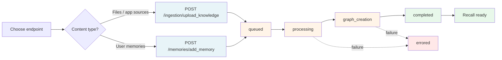

## Lifecycle



Blue = ingestion endpoints. Orange = async pipeline. Green = ready. Red = failure state.

## Endpoint reference

| Endpoint | Method | Purpose | Async? |
|---|---|---|---|
| [`/ingestion/upload_knowledge`](/api-reference/endpoint/upload-knowledge) | `POST` | Ingest files and/or app sources | Yes |
| [`/ingestion/verify_processing`](/api-reference/endpoint/verify-processing) | `POST` | Check processing status | No |

For user memories, see [`POST /memories/add_memory`](/api-reference/endpoint/add-memory).

## Which endpoint should I use?

| Content | Endpoint |
|---|---|
| PDFs, DOCX, CSVs, and other files HydraDB should parse | [`/ingestion/upload_knowledge`](/api-reference/endpoint/upload-knowledge) (`files`) |
| Slack messages, Notion pages, Gmail threads, webpages with pre-extracted text | [`/ingestion/upload_knowledge`](/api-reference/endpoint/upload-knowledge) (`app_sources`) |
| User preferences, conversation history, inline notes | [`/memories/add_memory`](/api-reference/endpoint/add-memory) |
| Pre-computed embedding vectors | [`/embeddings/insert_raw_embeddings`](/api-reference/endpoint/insert-raw-embeddings) |

## Typical call sequence

```
1. POST /ingestion/upload_knowledge   → returns source_ids, status: queued
2. POST /ingestion/verify_processing  → poll until status: completed
3. POST /recall/full_recall           → content is now retrievable
```

For batched uploads with mixed content:

```
1. POST /ingestion/upload_knowledge with files=[...] AND app_sources=[...]
   → single request, multiple source_ids in response
2. POST /ingestion/verify_processing with all source_ids
   → check all statuses in one call
```

## Status pipeline

| Status | Searchable? |
|---|---|
| `queued` | No |
| `processing` | No |
| `graph_creation` | **Yes** – via `full_recall` and `recall_preferences` |
| `completed` | Yes – via all recall endpoints, with full graph context |
| `errored` | No – inspect `error_code` and `error_message` |

Items in `graph_creation` are already retrievable. Wait for `completed` only when you specifically need full graph traversal.

## Key concepts

**Source** – Any unit of ingested content. Files become sources, app sources become sources, memory items become sources. Each gets a unique `source_id`.

**Files vs app sources** – Files require parsing (HydraDB extracts text, layout, metadata). App sources arrive pre-parsed – you supply the text and structured metadata directly.

**Multipart form data** – `/ingestion/upload_knowledge` always uses `multipart/form-data`, even when sending only `app_sources` (no actual files). Nested JSON fields (`file_metadata`, `app_sources`) must be sent as JSON-stringified form values.

**Upsert** – By default, ingesting a source with an existing ID overwrites the previous version. Set `upsert: false` to fail instead.

**Forceful relations** – At ingestion time, you can declare relationships between sources via the `relations` field. These are surfaced in `thinking`-mode recall as `additional_context`.

## Related sections

- [Essentials → Memories](/essentials/memories) – memories vs knowledge, when to use which
- [Essentials → Metadata](/essentials/metadata) – tenant-level vs document-level metadata
- [Essentials → Forceful Relations](/essentials/forceful-relations) – linking sources at ingestion
- [API Reference → Recall](/api-reference/endpoint/full-recall) – retrieve ingested content
