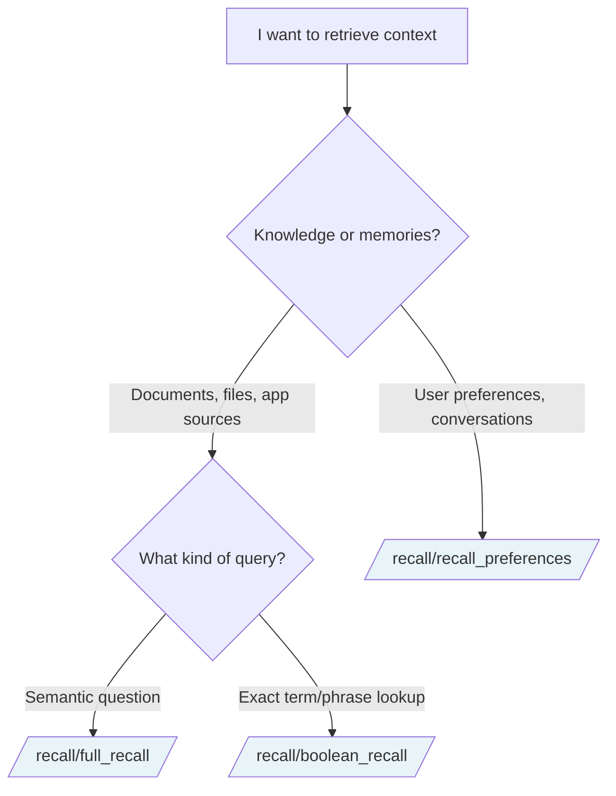

## Which recall endpoint should I use?



## Endpoint reference

| Endpoint | Method | Purpose | Returns |
|---|---|---|---|
| [`/recall/full_recall`](/api-reference/endpoint/full-recall) | `POST` | Hybrid recall over knowledge | Ranked chunks + optional graph context |
| [`/recall/recall_preferences`](/api-reference/endpoint/recall-preferences) | `POST` | Hybrid recall over user memories | Ranked memory chunks + optional graph context |
| [`/recall/boolean_recall`](/api-reference/endpoint/boolean-recall) | `POST` | Exact-match full-text search | BM25-ranked chunks |

## Side-by-side comparison

| | `full_recall` | `recall_preferences` | `boolean_recall` |
|---|---|---|---|
| **Searches** | Knowledge | Memories | Either (via `search_mode`) |
| **Match type** | Semantic + graph | Semantic + graph | Exact term/phrase |
| **Returns** | Chunks | Chunks | Chunks |
| **Latency** | Medium | Medium | Lowest |
| **Best for** | Document Q&A, RAG context | Personalization | Compliance lookups, exact matches |

## Modes

Two of the three endpoints (`full_recall`, `recall_preferences`) accept a `mode` parameter:

| Mode | Behavior | When to use |
|---|---|---|
| `fast` (default) | Single query pass, no reranking | Real-time chat, autocomplete, simple lookups |
| `thinking` | Multi-query expansion, reranking, forceful-relation context | Complex queries, customer-facing answers, anything where quality matters |

`boolean_recall` doesn't have modes – it's deterministic by design.

## Common parameters

`full_recall` and `recall_preferences` share most parameters:

| Parameter | Default | Purpose |
|---|---|---|
| `query` | – | The user's input |
| `mode` | `fast` | Retrieval quality vs latency |
| `alpha` | `0.8` | Hybrid weight (semantic vs keyword) |
| `recency_bias` | `0.0` | Prefer newer content |
| `metadata_filters` | – | Deterministic scoping |
| `graph_context` | `false` | Include entity relationships |

## Typical patterns

### Personalized Q&A

```python
# 1. Recall user's preferences first
prefs = client.recall.recall_preferences(
    tenant_id="acme",
    sub_tenant_id="user_alex",
    query="how does the user like answers formatted?",
)

# 2. Then recall the actual knowledge
result = client.recall.full_recall(
    tenant_id="acme",
    query="What's our refund policy?",
    additional_context=format_prefs(prefs),  # use prefs as extra signal
    mode="thinking",
)
```

### Document Q&A with citations

```python
# Retrieve context, then pass to your LLM of choice
result = client.recall.full_recall(
    tenant_id="acme",
    query="What's our refund policy?",
    mode="thinking",
    graph_context=True,
)

# Build prompt for your LLM with retrieved chunks
context = "\n\n".join(c.chunk_content for c in result.chunks)
sources = [c.source_title for c in result.chunks]

# answer = your_llm.complete(f"Context:\n{context}\n\nQuestion: ...")
# cite using `sources`
```

### Compliance lookup

```python
# Exact match for a regulatory term
result = client.recall.boolean_recall(
    tenant_id="acme",
    query="GDPR Article 17",
    operator="phrase",
    search_mode="sources",
)
```

## Key concepts

**Hybrid retrieval** – Combines semantic similarity (embeddings) with keyword matching (BM25). The `alpha` parameter controls the weight. Default `0.8` favors semantic.

**Graph context** – Entity relationships extracted from your data. Optional. Helps surface "how things connect" in addition to "what's similar."

**`thinking` mode** – Expands the query into multiple sub-queries, retrieves for each, and reranks the combined results. Higher quality, higher latency.

**Forceful relations** – Sources can be explicitly linked at ingestion. In `thinking` mode, recall surfaces context from these linked sources via the `additional_context` field.

## Related sections

- [Essentials → Recall](/essentials/recall) – conceptual overview, the multi-stage pipeline
- [Essentials → Context Graphs](/essentials/context-graphs) – how graph context is built and used
- [Essentials → Forceful Relations](/essentials/forceful-relations) – linking sources explicitly
- [API Reference → Memories](/api-reference/endpoint/add-memory) – ingest memories before recall
- [API Reference → Ingestion](/api-reference/endpoint/upload-knowledge) – ingest knowledge before recall
