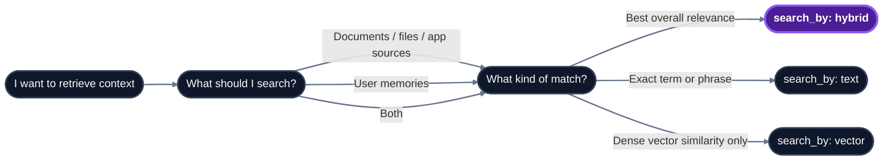

import { Field } from "/snippets/field.jsx";

Use this page to choose the right search shape before opening the full [Search](/api-reference/v2/endpoint/search) endpoint reference. Search has three main decisions: what to search (`source`), how to match (`search_by`), and how much retrieval work to spend (`mode`).



## Parameters that matter

| Parameter | Values | Use it for |
|---|---|---|
| <Field name="source" /> | `"knowledge"`, `"memories"`, `"all"` | Choose the collection. Use `"knowledge"` for shared docs/app sources, `"memories"` for user context, and `"all"` when an answer should use both. |
| <Field name="search_by" /> | `"hybrid"`, `"text"`, `"vector"` | Choose the matching method. Use `"hybrid"` by default, `"text"` for exact terms or phrases, and `"vector"` only when you want pure dense similarity. |
| <Field name="mode" /> | `"fast"`, `"thinking"` | Choose latency vs quality. Use `"fast"` for low-latency paths and `"thinking"` for multi-query retrieval, reranking, and forceful-relation context. |
| <Field name="max_results" /> | integer | Control prompt size. Start with `10`, reduce for tight context windows, increase only when you rerank or summarize downstream. |
| <Field name="alpha" /> | `0.0`-`1.0` or `"auto"` | Tune hybrid search. Lower values favor BM25 keywords; higher values favor semantic similarity. |
| <Field name="metadata_filters" /> | object | Narrow candidates before ranking. Top-level keys match `tenant_metadata`; nested `document_metadata` filters free-form per-source fields. |
| <Field name="graph_context" /> | boolean | Include entity/relation context with the chunks. On by default; set `false` for chunk-only responses. |

<Tip>
For filter design, read [Essentials - Metadata](/essentials/v2/metadata) before creating tenant schemas. For exact request fields, defaults, and response shape, use [Search](/api-reference/v2/endpoint/search).
</Tip>

## Recommended configurations

| User intent | Recommended config |
|---|---|
| Fast document RAG | `source="knowledge"`, `search_by="hybrid"`, `mode="fast"`, `max_results=5-10`, `graph_context=false` |
| Highest-quality document RAG | `source="knowledge"`, `search_by="hybrid"`, `mode="thinking"`, `graph_context=true`, `alpha="auto"` |
| Personalized answer | `source="all"`, include `sub_tenant_id`, `search_by="hybrid"`, `mode="thinking"` |
| User preferences only | `source="memories"`, include `sub_tenant_id`, `search_by="hybrid"` |
| Exact keyword or phrase | `source="knowledge"`, `search_by="text"`, `operator="phrase"` |
| Recent operational updates | `search_by="hybrid"`, `recency_bias=0.2-0.4`, filter to the right document type |

## Typical patterns

<AccordionGroup>
  <Accordion title="Document Q&A from shared knowledge" defaultOpen>

Use this for standard RAG over docs, PDFs, tickets, pages, or app sources.

```json
{
  "tenant_id": "acme",
  "query": "What is our refund policy?",
  "source": "knowledge",
  "search_by": "hybrid",
  "mode": "thinking",
  "max_results": 10,
  "graph_context": true
}
```

  </Accordion>

  <Accordion title="Personalized answer with memories">

Use this when the answer should combine shared knowledge with user-specific context. Always pass the same `sub_tenant_id` used at memory ingestion.

```json
{
  "tenant_id": "acme",
  "sub_tenant_id": "user_alex",
  "query": "What is our refund policy, and how should I explain it to this user?",
  "source": "all",
  "search_by": "hybrid",
  "mode": "thinking"
}
```

  </Accordion>

  <Accordion title="Filtered search for a specific slice">

Use `metadata_filters` when you already know the slice you want. Top-level keys must be declared in `tenant_metadata_schema` with `enable_match: true`; free-form per-source fields go under `document_metadata`.

```json
{
  "tenant_id": "acme",
  "query": "What launch constraints apply to enterprise customers?",
  "source": "knowledge",
  "search_by": "hybrid",
  "metadata_filters": {
    "department": "product",
    "document_metadata": {
      "source": "launch_plan"
    }
  }
}
```

  </Accordion>

  <Accordion title="Exact phrase lookup">

Use text search when literal wording matters: legal clauses, SKUs, error codes, IDs, or compliance references.

```json
{
  "tenant_id": "acme",
  "query": "GDPR Article 17",
  "source": "knowledge",
  "search_by": "text",
  "operator": "phrase"
}
```

  </Accordion>
</AccordionGroup>

## Response summary

`POST /search` returns ranked `chunks[]`, deduplicated `sources[]`, optional `graph_context`, and optional `additional_context` from forceful relations. Preserve `chunks[]` order when building prompts; HydraDB has already ranked the results. For prompt formatting and citation patterns, see [How to Use API Results](/essentials/v2/api-results).

## Related sections

- [Search](/api-reference/v2/endpoint/search) - full endpoint reference
- [Essentials - Search](/essentials/v2/search) - conceptual overview, retrieval modes, and ranking behavior
- [Essentials - Metadata](/essentials/v2/metadata) - filtering with tenant and document metadata
- [Essentials - Context Graphs](/essentials/v2/context-graphs) - graph context and relation paths
