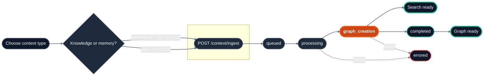

## Endpoint references

| Task | Endpoint |
| :-- | :-- |
| Ingest a file HydraDB should parse | `POST /context/ingest` with `type=knowledge` and `documents` |
| Ingest normalized Slack, Notion, email, or web content | `POST /context/ingest` with `type=knowledge` and `app_knowledge` |
| Ingest a preference, conversation signal, or inline note | `POST /context/ingest` with `type=memory` and `memories` |
| Check whether a source is searchable | `GET /context/status` |
| List stored sources or memories | `POST /context/list` |
| Inspect an original source or presigned download URL | `GET /context/inspect` |
| Update metadata without re-ingesting content | `PATCH /context/sources/{source_id}/metadata` |
| List graph relations | `GET /context/relations` |
| Delete sources or memories | `DELETE /context` |

## Lifecycle



<Note>
  **Why both** `type=knowledge` **and** `app_knowledge`**?** They make two separate decisions.

  - `type` picks the **bucket**: `knowledge` (shared documents) or `memory` (per-user context). It routes the ingest to the right store.
  - Within `type=knowledge`, you pick the **payload shape**: `documents` (binary documents HydraDB will parse  -  PDFs, DOCX, CSV) or `app_knowledge` (a JSON array of already-extracted content from your app  -  Slack messages, Notion pages, web pages). You can send both in the same request.
</Note>

## Core Ingestion Concepts

- **Knowledge vs. Memories**: [Knowledge](/essentials/v2/knowledge) is shared, database-wide content (documents, app pages, Slack messages). [Memories](/essentials/v2/memories) are user-specific preferences and conversational traits scoped by `collection`. Both can be searched together via `type: "all"` on `POST /query`.
- **IDs**: Unique identifiers returned by `/context/ingest`. For Knowledge, set `id` in a `document_metadata` entry or an `app_knowledge` item. For Memory, set `id` in the memory item. Use IDs for status checks, inspection, updates, relations, and deletion.
- **Metadata filtering**: Use the database and collection for access scope first. Then use schema-backed `metadata` and free-form `additional_metadata` to narrow a query. For detailed guidance, see [Metadata](/essentials/v2/metadata).
- **Forceful Relations**: Relationships between sources can be declared at ingestion time to construct a robust knowledge graph. For more details on the graph layer, see the [Context Graphs](/essentials/v2/context-graphs) guide.

## Forceful relations and metadata

Forceful relations let you pre-wire document relationships at ingestion time so that relevant documents surface together during retrieval - even before the graph layer discovers connections organically. Think of them as explicit "see also" links between your documents.

Paired with document-level metadata, you get deterministic control over how results are filtered and ranked.

```python Python SDK
result = client.context.ingest(
    type="knowledge",
    database="acme_corp",
    documents=[("runbook.pdf", f, "application/pdf")],
    document_metadata=json.dumps([{
        "id": "runbook_deploy",
        "metadata": {"department": "ops"},
        "additional_metadata": {"owner": "platform-team"},
        "relations": {"ids": ["monitoring_guide"]},
    }]),
)
```

## Related sections

- [Usage - Forceful Relations](/essentials/v2/knowledge) - linking sources at ingestion (see §7)
- [Query](/api-reference/v2/endpoint/query-overview) - retrieve ingested content

<Tip>
  Related Resources

  - [Usage - Memories](/essentials/v2/memories) - memories vs knowledge, when to use which

  - [Usage - Metadata](/essentials/v2/metadata) - database-level vs document-level metadata
</Tip>
