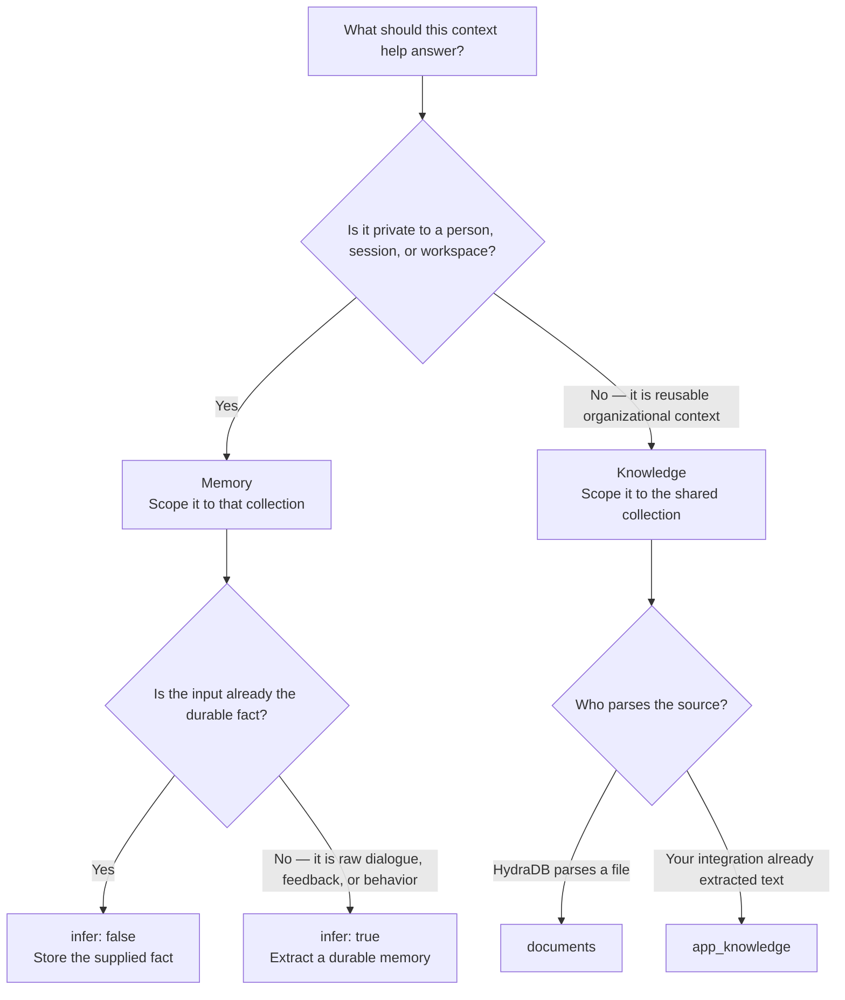
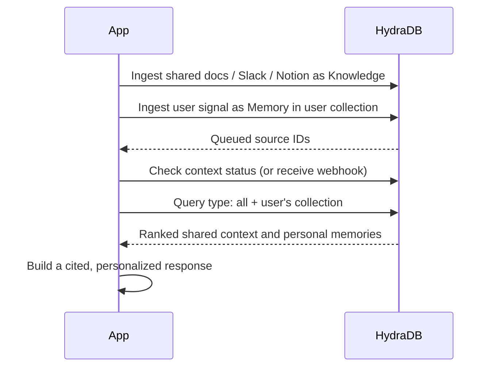

HydraDB has two context stores. Choosing between them is primarily a **scope and lifecycle** decision—not a file-format decision.

<Tip>
  Do not use Memory as a default bucket for every conversation. Store only context you intend to retain and retrieve later; keep the original conversation or audit record in your system of record when you need it.
</Tip>

## Start with this decision tree

## The short answer

| Question | Choose | Example |
| --- | --- | --- |
| Is the context specific to an individual or private workspace? | **Memory** | A user's preferred answer style or a support interaction that should personalize later replies. |
| Is it shared reference material that people in an allowed scope may reuse? | **Knowledge** | A policy PDF, Notion page, Slack thread, ticket, or product brief. |
| Should the answer use both? | Ingest each into its own store, then query `type: "all"`. | Answer a refund-policy question using the policy and the customer's communication preference. |

The same source can legitimately produce both kinds of context. For example, a support transcript may remain in your helpdesk as the authoritative record, create a **Memory** such as “prefers email updates,” and refer to **Knowledge** such as the current refund policy. Do not copy the entire transcript into both stores unless each copy has a clear retrieval purpose and retention policy.

## Memory vs. Knowledge

| | Memory | Knowledge |
| --- | --- | --- |
| Best for | Durable preferences, decisions, traits, and user/workspace context | Reusable documents, app records, and organizational facts |
| Typical lifecycle | Changes as a person or workspace changes; can use `expiry_time` | Updated by re-ingesting a stable ID or deleting the old source |
| Write | `POST /context/ingest` with `type=memory` and `memories` | `POST /context/ingest` with `type=knowledge` and `documents` or `app_knowledge` |
| Read | `POST /query` with `type: "memory"` | `POST /query` with `type: "knowledge"` |
| Combined read | `POST /query` with `type: "all"` | `POST /query` with `type: "all"` |

### Scope is a security boundary

Use `database` for the hard isolation boundary and `collection` for the user, workspace, team, or other logical scope inside it. Use the same scope when you ingest and query.

- Do not put one user's private memory in a shared collection.
- Do not assume Knowledge is globally visible: scope shared knowledge to only the collection(s) that should retrieve it.
- Do not use metadata filters as an access-control substitute. Choose the correct database and collection first, then use metadata to narrow results.

For detailed scope patterns, see [Multi-tenant support](/essentials/v2/multi-tenant).

## Choose `infer`

`infer` applies to **Memory** ingestion. It controls whether HydraDB derives a durable memory from the input or indexes the supplied content as-is.

| Input you have | `infer` | Why |
| --- | --- | --- |
| “User prefers concise, bulleted answers.” | `false` | The fact is already explicit; preserve it exactly. |
| A conversation in which the user repeatedly asks for a TL;DR | `true` | Extract the useful preference from indirect evidence. |
| Product events showing a user chose dark mode | `true` | Turn raw behavior into a durable preference. |
| An account-plan field or an approved support note | `false` | Keep a deterministic, auditable value. |

Use `custom_instructions` only with `infer: true` to constrain what HydraDB extracts—for example, “Extract communication preferences only.” When `infer: false`, it has no effect.

<Warning>
  Inference is not an authorization mechanism or a substitute for review. Avoid inferring sensitive traits unless your product, consent model, and retention policy explicitly allow it.
</Warning>

## Match ingestion to retrieval

| Goal | Ingest | Wait for | Query |
| --- | --- | --- | --- |
| Store a known user preference | `type=memory`, `memories`, `infer: false` | `GET /context/status` reports `graph_creation` or `completed` | `type: "memory"` |
| Learn from raw conversation or behavior | `type=memory`, `memories`, `infer: true` | `GET /context/status` | `type: "memory"` |
| Index a PDF, DOCX, CSV, Markdown, or text file | `type=knowledge`, `documents` | `GET /context/status` | `type: "knowledge"` |
| Index a Slack, Notion, ticket, or email record your integration already normalized | `type=knowledge`, `app_knowledge` | `GET /context/status` | `type: "knowledge"`; add `query_apps: true` to a hybrid knowledge query when app-aware matching helps |
| Give a personalized answer grounded in shared material | Ingest Memory and Knowledge separately | Status for both items | `type: "all"`, with the caller's `collection` |

`202 Accepted` from ingestion means work is queued, not that the source is searchable. Poll [source status](/api-reference/v2/endpoint/source-status), or use [webhooks](/essentials/v2/webhooks), before relying on a new item in a query.

## A minimal personalized-answer flow

For a complete implementation, see [Build a personalized company assistant](/cookbooks/v2/personalized-company-assistant).

## Common mistakes

| Mistake | Better approach |
| --- | --- |
| “It mentions a user, so it must be Memory.” | Decide who may retrieve it and whether it is durable personal context. A shared Slack announcement is usually Knowledge. |
| Sending an already normalized preference with `infer: true` | Use `infer: false` to avoid unnecessary transformation. |
| Using `infer: false` for raw event logs and expecting a preference | Use `infer: true`, with narrow `custom_instructions` if needed. |
| Writing to one collection and querying another | Carry the same database and collection through the request lifecycle. |
| Querying only Knowledge for a personalized response | Use `type: "all"` and the caller's collection. |
| Treating a queued ingestion response as searchable | Wait for status `graph_creation` or `completed`. |

## Related

- [Memories](/essentials/v2/memories)
- [Knowledge](/essentials/v2/knowledge)
- [App sources](/essentials/v2/app-sources)
- [Query](/essentials/v2/query)
- [Ingest Context](/api-reference/v2/endpoint/ingest-context)
