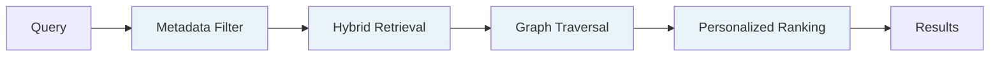

## What HydraDB is

AI agents are stateless by default. Every session starts from zero. The field of memory and context infrastructure exists to fix this — and most of today's stack does it badly.

HydraDB is a retrieval API for stateful AI agents. You ingest your documents, user interactions, and preferences, and HydraDB autonomously builds a context graph capturing entities and relationships. When your agent asks a question, HydraDB returns the *useful* context — not just the similar context.

> *VectorDBs find what's similar. HydraDB finds what's useful.*

HydraDB is designed for teams building scalable, stateful AI agents, whether you're at 10K documents or 10M.

**HydraDB** is developer-first, plug-and-play context infrastructure. Imagine Stripe for context, instead of payments. Rather than hacking together brittle pipelines for embedding tools, vector databases, ranking tweaks, and caching layers, HydraDB replaces all of it in a single API call — with better retrieval than a traditional vector database.

**Some use cases:**

- Customer support agents grounded in real customer history and preferences
- Coding agents with persistent memory of a codebase and team conventions
- Clinical companions tracking patient context across visits
- Research copilots reasoning across papers, authors, findings
- Internal knowledge assistants spanning Slack, Notion, Drive, and email
- Consumer AI apps where every user gets a "second brain" that evolves over time

Find more use cases at [Cookbooks](/cookbooks).

**Skip ahead:** [Quickstart](/quickstart) · [API Reference](/api-reference) · [SDKs](/sdk/overview)

---

## Why vector search breaks for stateful AI

Vector databases are search engines. They answer one question well: *"What's most similar to this query?"*

That's fine for static retrieval. It breaks for **stateful agents**.

The structural reason: vector search treats every chunk as an isolated point. There is no concept of who said what, what is contradicted later, what is stale, or how an entity has evolved over time.

At 10M+ documents, a vector search will confidently return an answer pulled from a completely different client's file. The similarity score might read 0.94. The answer is still wrong.

The failure mode isn't the embedding model. It's the assumption that semantic similarity equals relevance.

---

## How HydraDB is different

HydraDB is **graph-first, not graph-optional**. The graph is the primary substrate; vectors are one of several signals feeding into it.

It builds an **ontology-first context graph** over your data. Entities, relationships, and temporal signals are extracted automatically at write time. When you query for "Apple," HydraDB knows you mean the customer you serve, not the fruit.

Every retrieval runs through a multi-stage intelligent recall pipeline:

---

## What sets HydraDB apart

**One endpoint, one stack.** HydraDB replaces a Neo4j + vector DB + Redis stack. One API manages Memories, Knowledge, semantic context, and relational context together.

**Memories and Knowledge as distinct primitives.** Other tools treat all stored data the same way. HydraDB separates them at the infrastructure level — Memories are dynamic, interaction-level state that evolves with every session; Knowledge is static, document-level context that gets versioned and replaced. Different storage layers, different retrieval paths, one unified API.

**Composable and unopinionated.** You control what gets stored as vectors, what becomes graph nodes, which relationships matter, and how retrieval is parameterized — recency alpha, forced relations, custom embeddings, custom metadata. The complex base is ours; the configuration is yours.

---

## Key features

- **Ontology-first context graph** — entities and relationships extracted automatically
- **Memories + Knowledge primitives** — separated storage, unified API
- **Hybrid retrieval** — semantic, keyword, graph, and metadata signals in one call
- **Multi-tenant by default** — fully isolated workspaces at tenant and sub-tenant levels
- **Plug-and-play SDK** — TypeScript and Python with full type safety
- **Bring-your-own embeddings** — plug in fine-tuned models when needed
- **Self-hosting** — deploy with a single Docker command

## Performance

- 90% on LongMemEvals
- Sub-200ms retrieval latency
- In-memory processing for hot paths
- No cross-tenant data aggregation

---

## Get started

1. Sign up at [app.hydradb.com](https://app.hydradb.com) for your API key
2. Follow the [Quickstart](/quickstart) — get your first recall in five minutes
3. Explore [Core Concepts](/core-concepts) and the [API Reference](/api-reference)

For enterprise onboarding, contact [founders@hydradb.com](mailto:founders@hydradb.com).
